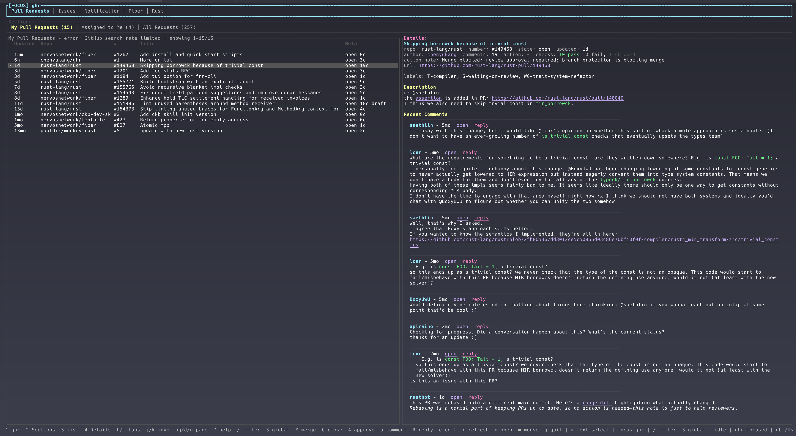

# ghr

`ghr` is a fast terminal dashboard for GitHub work queues. It focuses on the things you need to scan often: pull requests, issues, notifications, descriptions, and recent comments.



## Features

- Pull request, issue, and notification views.
- Snapshot-first startup: cached data is shown immediately, then refreshed in the background.
- Configurable sections, including multi-query sections such as `All Requests`.
- Fuzzy filtering in every list with `/`.
- Details pane with descriptions and recent comments.
- Local state under `~/.ghr`: config, SQLite snapshot database, and logs.
- Uses the GitHub CLI for authentication, API access, and browser opening behavior.

## Requirements

- Rust
- GitHub CLI (`gh`)
- An authenticated GitHub CLI session:

```bash
gh auth login
```

## Usage

Install from crates.io:

```bash
cargo install ghr-cli
ghr
```

## Keybindings

| Key | Action |
| --- | --- |
| `1` / `2` / `3` / `4` | Focus ghr / Sections / list / Details |
| `h` / `l` | Move within the focused ghr or Sections tab group |
| `Enter` | Focus the details pane from the list |
| `Esc` | Return from details to list, or clear search |
| `j` / `k` | Move selection in list, or scroll details when details is focused |
| `/` | Fuzzy filter the current list |
| `S` | Search matching PRs and issues in the current repo |
| `o` | Open the selected item in the browser |
| `M` | Open a merge confirmation for the selected PR |
| `C` | Open a close confirmation for the selected PR |
| `A` | Open an approve confirmation for the selected PR |
| `y` / `Enter` | Confirm the current PR action in the confirmation dialog |
| `r` | Refresh from GitHub |
| `q` | Quit |

## Default Sections

Pull Requests:

- `My Pull Requests`: open PRs authored by you.
- `Assigned to Me`: open PRs assigned to you.
- `All Requests`: recent PRs authored by you, involving you, or reviewed by you, including closed PRs.

Issues:

- `Assigned to Me`
- `Mentioned`
- `Involved`

Notifications:

- `Unread`
- `Review Requested`
- `Assigned`
- `Mentioned`
- `All`

## Configuration

The config file is created at:

```text
~/.ghr/config.toml
```

Example:

```toml
exclude_repos = ["some-org/archive-*"]

[[repos]]
name = "Rust"
repo = "rust-lang/rust"
show_prs = true
show_issues = true

[defaults]
view = "pull_requests"
pr_per_page = 50
issue_per_page = 50
notification_limit = 50
refetch_interval_seconds = 120
include_read_notifications = true

[[pr_sections]]
title = "My Pull Requests"
filters = "is:open author:@me archived:false sort:updated-desc"

[[pr_sections]]
title = "All Requests"
queries = [
  "author:@me archived:false sort:updated-desc",
  "involves:@me -author:@me archived:false sort:updated-desc",
  "reviewed-by:@me -author:@me archived:false sort:updated-desc",
]
```

Use `filters` for a single GitHub search query. Use `queries` when a section should merge several GitHub searches into one deduplicated list.

Use `[[repos]]` to add repository tabs to the top bar. Each configured repo shows its `name` as a top-level tab; inside that tab, `show_prs` and `show_issues` control whether the sections are shown as `Pull Requests` and `Issues`. Repo tabs default to open PRs and open issues.

## Local Data

`ghr` keeps all local files in `~/.ghr`:

- `config.toml`: user configuration
- `ghr.db`: SQLite snapshot cache
- `ghr.log`: log file

The snapshot cache is intentionally local and disposable. Delete `~/.ghr/ghr.db` if you want to rebuild it from GitHub.

## Design Notes

`ghr` is inspired by tools like `ghui` and `gh-dash`, but it is not a strict rewrite. The main goal is a responsive Rust TUI that opens instantly from cached state, then refreshes GitHub data in the background.
