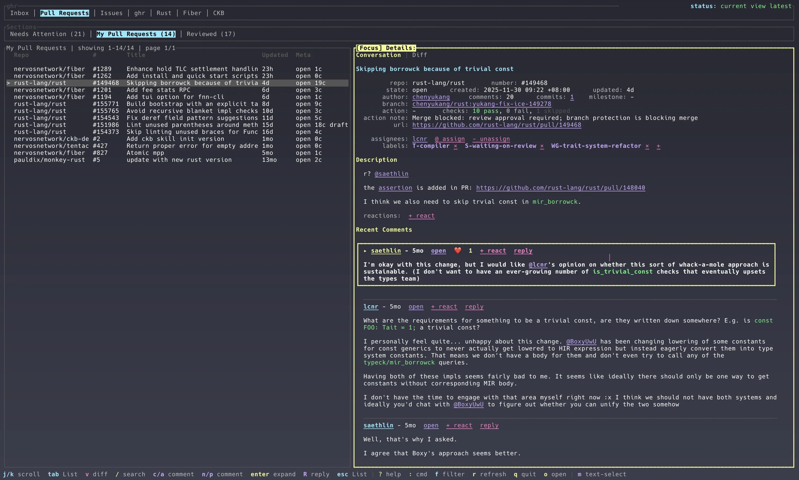
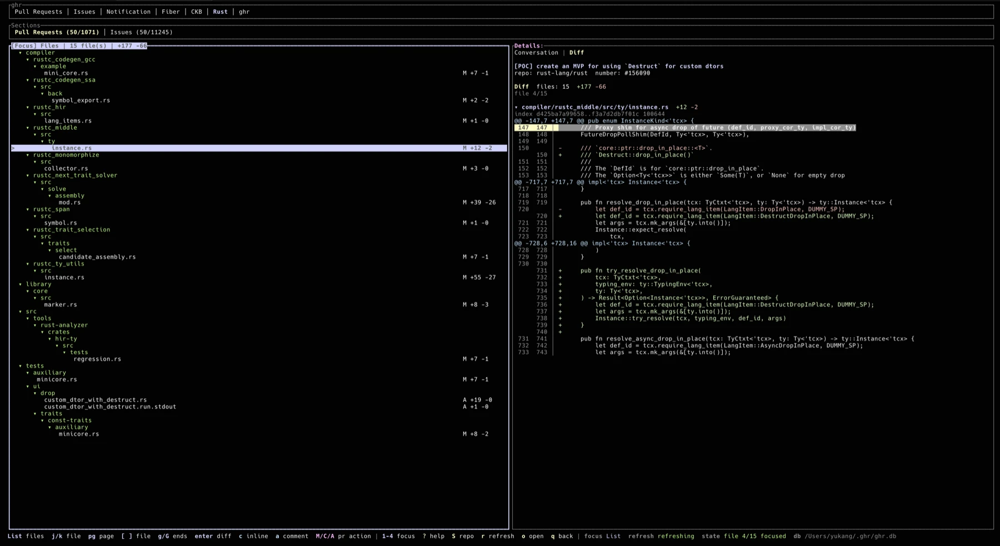

# ghr

`ghr` is a fast terminal workspace for staying on top of GitHub. It brings pull requests, issues, notifications, repo tabs, conversations, checks, and diffs into one stateful TUI, so you can triage, review, comment, approve, merge, and jump back in without waiting on a fresh GitHub fetch.

[](https://github.com/chenyukang/ghr/actions/workflows/ci.yml)
[](https://github.com/chenyukang/ghr/actions/workflows/release.yml)

**Conversation and triage view**



**Pull request diff review view**



## Features

- Pull request, issue, and notification views.
- Snapshot-first startup: cached data is shown immediately, then refreshed in the background.
- Configurable sections and repo tabs, including multi-query sections such as `All Requests`.
- Automatic current-repo tab when launched inside a Git checkout with a GitHub remote.
- Paged PR and issue lists with configurable page size.
- Fuzzy filtering in every loaded list with `/`, plus repo-scoped GitHub search with `S`.
- Details pane with rendered Markdown, clickable links, fenced code blocks with lightweight Rust and plain/log highlighting, descriptions, comments, review comments, labels, action hints, and check summaries.
- PR diff mode with a changed-file list, per-file diff rendering, inline review comments, and review ranges.
- Comment, reply, edit, merge, close, approve, and draft / ready-for-review flows from inside the TUI.
- Unread notification handling with local cache updates and GitHub read-state sync.
- Mouse support for tabs, lists, links, comments, scrolling, text selection mode, and split resizing.
- UI state persistence under `~/.ghr`, including focus, selected item, scroll position, split ratio, and diff mode.
- Local state under `~/.ghr`: config, SQLite snapshot database, logs, and UI state.
- Uses the GitHub CLI for authentication, API access, and browser opening behavior.

## Requirements

- GitHub CLI [gh](https://cli.github.com/)
- An authenticated GitHub CLI session:

```bash
gh auth login
```

## Usage

Install from crates.io:

```bash
cargo install ghr-cli
ghr
```

## Keybindings

Press `?` in the TUI for the live shortcut reference. The status bar also changes by focused area.

| Key | Action |
| --- | --- |
| `1` / `2` / `3` / `4` | Focus ghr / Sections / list / Details |
| `Tab` / `Shift+Tab` | Move within the focused tab group |
| `h` / `l` | Move within the focused ghr or Sections tab group, wrapping at the ends |
| `Enter` | Focus the details pane from the list |
| `Esc` | Return from details to list, clear search, or leave diff details back to diff files |
| `j` / `k` | Move list selection, choose diff files, select diff lines, or scroll details |
| `PgDown` / `PgUp` or `d` / `u` | Page list/details movement |
| `n` / `p` in Details | Focus next/previous comment; in diff mode, page through the file diff |
| `g` / `G` | Jump to top/bottom in list, details, or diff |
| `[` / `]` | Load previous/next GitHub result page, or switch diff files in diff mode |
| `/` | Fuzzy filter the current list |
| `S` | Search matching PRs and issues in the current repo |
| `v` | Open PR diff mode |
| `q` in diff mode | Return to the state before opening diff |
| `o` | Open the selected item in the browser; in diff mode, open the PR `changes` page |
| `a` | Add a normal issue or PR comment |
| `c` in Details | Add a normal comment in conversation mode, or an inline review comment in diff mode |
| `R` | Reply to the focused comment |
| `e` | Edit the focused comment when it is yours; in diff mode, end a review range |
| `m` | Toggle terminal text selection mode; in diff details, begin a review range |
| `M` | Open a merge confirmation for the selected PR |
| `C` | Open a close confirmation for the selected PR |
| `A` | Open an approve confirmation for the selected PR |
| `D` | Toggle the selected open PR between draft and ready for review |
| `y` / `Enter` | Confirm the current PR action in the confirmation dialog |
| `Ctrl+Enter` | Send or update a comment from the comment dialog |
| `r` | Refresh from GitHub |
| `q` / `Ctrl+C` | Save UI state and quit |

Diff review ranges:

- Press `m` on a diff line to begin a range, move the highlight, then press `e` to end it.
- Press `c` after ending a range to post an inline review comment for the selected range.
- A single mouse click begins or moves a range; a double click ends it.

Mouse behavior:

- Click ghr or Sections tabs to switch views or sections.
- Click list rows to select them and focus Details. Mouse hover and mouse wheel do not change PR/issue selection.
- Scroll Details with the mouse wheel.
- Drag the split between list and Details to resize panes; the ratio is saved.
- Press `m` outside diff mode to temporarily disable TUI mouse capture for terminal text selection; press `m` again to restore mouse controls.

## Default Sections

Pull Requests:

- `My Pull Requests`: open PRs authored by you.
- `Assigned to Me`: open PRs assigned to you.
- `All Requests`: recent PRs authored by you, involving you, or reviewed by you, including closed PRs.

Issues:

- `Assigned to Me`
- `Mentioned`
- `Involved`

Notifications:

- `Unread`
- `Review Requested`
- `Assigned`
- `Mentioned`
- `All`

## Configuration

The config file is created at:

```text
~/.ghr/config.toml
```

Example:

```toml
[[repos]]
name = "Rust"
repo = "rust-lang/rust"
show_prs = true
show_issues = true

[defaults]
view = "pull_requests"
pr_per_page = 50
issue_per_page = 50
notification_limit = 50
refetch_interval_seconds = 120
include_read_notifications = true

[[pr_sections]]
title = "My Pull Requests"
filters = "is:open author:@me archived:false sort:updated-desc"

[[pr_sections]]
title = "All Requests"
queries = [
  "author:@me archived:false sort:updated-desc",
  "involves:@me -author:@me archived:false sort:updated-desc",
  "reviewed-by:@me -author:@me archived:false sort:updated-desc",
]

exclude_repos = ["some-org/archive-*"]
```

Use `filters` for a single GitHub search query. Use `queries` when a section should merge several GitHub searches into one deduplicated list.

Use `[[repos]]` to add repository tabs to the top bar. Each configured repo shows its `name` as a top-level tab; inside that tab, `show_prs` and `show_issues` control whether the sections are shown as `Pull Requests` and `Issues`. Repo tabs default to open PRs and open issues.

When `ghr` starts inside a Git checkout with a GitHub remote, it adds that repository as a runtime repo tab if it is not already configured. This does not write back to `config.toml`.

`pr_per_page` and `issue_per_page` control the page size used for PR and issue search sections. Use `[` and `]` in the list to load adjacent GitHub result pages.

## Local Data

`ghr` keeps all local files in `~/.ghr`:

- `config.toml`: user configuration
- `ghr.db`: SQLite snapshot cache
- `ghr.log`: log file
- `state.toml`: persisted UI state

The snapshot cache is intentionally local and disposable. Delete `~/.ghr/ghr.db` if you want to rebuild it from GitHub.

## Release

CI runs formatting, `cargo check`, strict `clippy`, tests on Linux and macOS, and `cargo package`.

Publishing is automatic on version tags:

```bash
git tag v0.2.0
git push origin v0.2.0
```

The release workflow verifies that the tag matches `Cargo.toml`, publishes `ghr-cli` to crates.io, and creates a GitHub release. Configure the repository environment `crates-io` with a `CARGO_REGISTRY_TOKEN` secret before pushing a release tag.

## Design Notes

`ghr` is inspired by tools like `gh-dash`, but it is not a strict rewrite. The main goal is a responsive Rust TUI that opens instantly from cached state, then refreshes GitHub data in the background.
